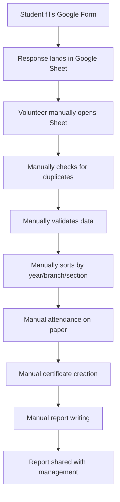
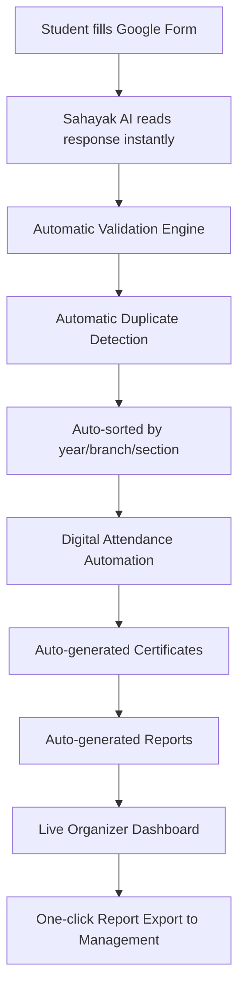
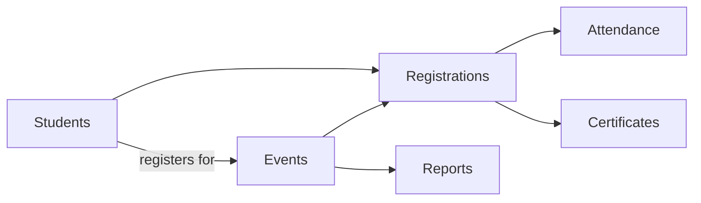
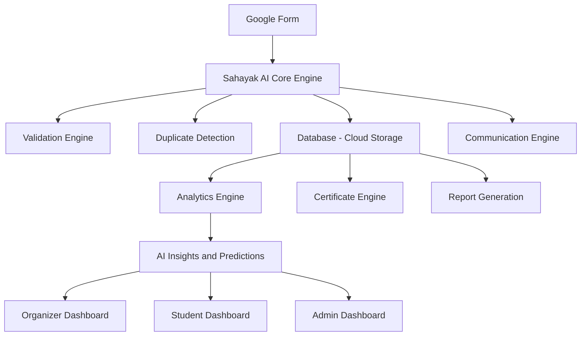
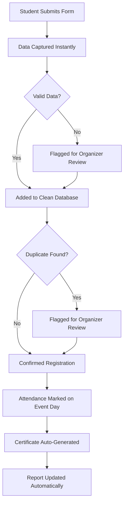
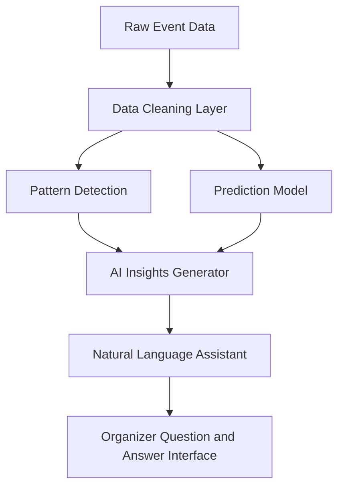
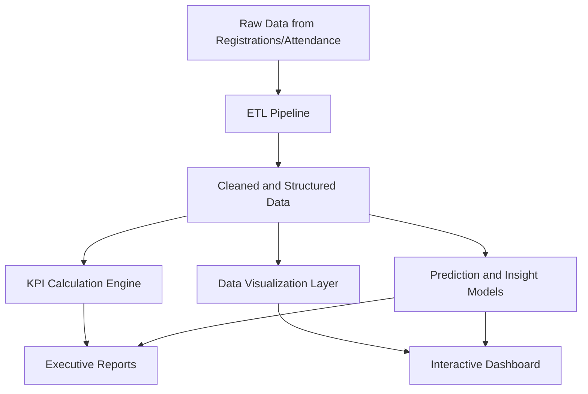
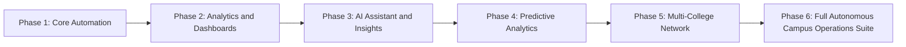

# SAHAYAK AI
### *One Form. Everything Automated.*
### *From Registration to Recognition — Fully Autonomous.*

---

**An AI-Powered Autonomous Campus Operations & Analytics Platform**

Prepared as a complete project brochure for students, professors, judges, developers, investors, organizers, and college management.

---

[IMAGE PLACEHOLDER]

**Prompt:**
Create a premium modern cover page illustration in Google Material Design style. White background with soft blue and white gradient accents. Center: a large rounded glass-morphism card showing the text "Sahayak AI" in a bold modern sans-serif font (like Google Sans), with the tagline "One Form. Everything Automated." underneath in a lighter weight. Around the card, show minimal flat-style icons floating: a Google Form icon, a checkmark shield (validation), a certificate icon, a bar chart icon, and a chat bubble icon, connected by thin blue dotted lines suggesting automation flow. Add a soft gradient background transitioning from white to light blue at the edges. Use a professional color palette of Google Blue (#4285F4), white, and soft gray. High resolution, presentation-quality, 16:9 aspect ratio.

---

## 1. Cover Page

**Project Name:** Sahayak AI
**Category:** Autonomous Campus Operations & Analytics Platform
**Built For:** Colleges, Communities, Event Organizers, Hackathon Teams, Student Bodies
**Tagline:** One Form. Everything Automated.

> **Note:** The word "Sahayak" means "helper" in Hindi. The name reflects the project's purpose — a tireless digital helper that takes over repetitive campus admin work so humans can focus on people, not paperwork.

---

## 2. Executive Summary

Sahayak AI is a system that sits quietly behind a Google Form and takes over everything that happens *after* someone fills it out.

Today, when a student fills a Google Form to register for an event, a human organizer has to open the resulting spreadsheet, clean it up, remove duplicate entries, check attendance manually, create certificate lists by hand, and write reports for management — often late at night, right before a deadline.

Sahayak AI removes this burden completely. It automatically validates data, detects duplicates, manages attendance, generates certificates, creates reports, and gives organizers a live dashboard (Dashboard — a single screen where all important information is shown together) to watch everything happen in real time.

**In one sentence:** Sahayak AI turns a simple Google Form into a fully automated event-management brain.

---

## 3. Vision

> *"A world where no student volunteer spends their weekend copy-pasting names from a spreadsheet — because the software already did it, correctly, the moment the form was submitted."*

Sahayak AI envisions every college fest, hackathon, seminar, and community meetup running on autopilot for the boring parts, so humans can focus on the creative and human parts — hosting, mentoring, and celebrating participants.

---

## 4. Mission

To build an intelligent, affordable, and easy-to-adopt automation layer that any student club, college department, or community — regardless of technical skill — can plug into their existing Google Form and instantly gain:

- Clean, validated data
- Automatic duplicate removal
- Live attendance tracking
- Auto-generated certificates
- Ready-made reports
- A simple analytics dashboard

Without hiring developers or buying expensive enterprise software.

---

## 5. Why Sahayak AI Exists

Every semester, thousands of college events happen — tech fests, workshops, cultural nights, hackathons, guest lectures. Almost all of them use Google Forms for registration because it's free and simple.

But Google Forms only *collects* data. It doesn't *understand* it. Someone still has to:

- Read every single response
- Spot fake or duplicate entries
- Match names to college ID numbers
- Sort people by year, branch, and section
- Track who actually attended
- Prepare certificates one by one
- Summarize everything for the Principal or sponsors

Sahayak AI exists because this workload is repetitive, error-prone, and takes away time from actually running a great event.

---

## 6. The Real Problem

| Problem | Real Impact |
|---|---|
| Duplicate registrations | Same student registers twice using different email IDs, messing up headcounts |
| Manual data cleaning | Volunteers spend hours fixing typos, missing fields, and inconsistent formats |
| No attendance system | Attendance is taken on paper, then typed into Excel later — full of errors |
| Certificate creation by hand | One certificate at a time in Canva or Word — for 500 students, this takes days |
| No real analytics | Organizers cannot answer simple questions like "Which branch participated the most?" |
| Reporting to management | Reports for the Principal or sponsors are built manually, last-minute, and often inaccurate |
| Communication chaos | WhatsApp groups and email lists are built by manually copying numbers from a sheet |

> **Callout Box — Real Cost:**
> A typical 500-student technical fest can consume **40–60 volunteer-hours** just on data cleaning, attendance, and certificate generation. Sahayak AI reduces this to **near zero human effort**.

---

## 7. Current Workflow (Before Sahayak AI)

> **Note:** Every single step above is done by a human, usually a stressed student volunteer, usually at the last minute.

---

## 8. Future Workflow (With Sahayak AI)

> **Note:** The only human step left is *reviewing and approving* — not doing the work itself.

---

## 9. Before vs After

| Task | Before Sahayak AI | After Sahayak AI |
|---|---|---|
| Duplicate check | Manual, hours of work | Instant, automatic |
| Data validation | Manual, error-prone | Automatic (Validation Engine) |
| Attendance | Paper-based, re-typed later | Digital, real-time |
| Certificates | Made one by one | Auto-generated in bulk |
| Reports | Built manually at the last minute | Auto-generated anytime, one click |
| Analytics | Doesn't exist | Full live dashboard |
| Communication lists | Manually copied | Auto-segmented and ready to export |
| Organizer's time spent | 40–60 hours per event | Under 2 hours per event |

---

## 10. Real-Life Example

**Scenario:** The Computer Science Department is hosting "CodeStorm 2026," a 3-day hackathon expecting 600 registrations.

**Without Sahayak AI:** Three volunteers spend an entire weekend before the event cleaning the spreadsheet, calling students to confirm details, and preparing a rough attendance sheet on paper. After the event, one volunteer spends two more days making 600 certificates in Canva.

**With Sahayak AI:** The moment the Google Form closes, Sahayak AI has already validated all 600 entries, flagged 14 duplicate registrations, sorted everyone by branch and year, and prepared a communication list. During the event, attendance is marked digitally and shows up live on the Organizer Dashboard. The moment the event ends, 586 certificates are generated automatically with correct names spelled exactly as submitted, and a full report is ready to send to the Head of Department within minutes.

---

## 11. Project Objectives

1. Eliminate manual data cleaning after Google Form submission.
2. Detect and flag duplicate or suspicious entries automatically.
3. Provide real-time, digital attendance tracking.
4. Auto-generate certificates in bulk with zero manual design work.
5. Auto-generate professional reports for management and sponsors.
6. Provide a simple, visual analytics dashboard for organizers.
7. Provide an AI Assistant that organizers can simply "ask questions" to.
8. Keep the entire system affordable and easy to set up for any student club.
9. Protect student data with strong privacy and security practices.
10. Make the system flexible enough to work for any type of event — technical, cultural, sports, or academic.

---

## 12. Core Philosophy

> **"Automate the boring. Preserve the human."**

Sahayak AI is deliberately designed to **never replace human decision-making** — it only removes repetitive manual labor. Organizers always retain final control: they review, approve, or override any automated decision (like a flagged duplicate) before it becomes final.

---

## 13. Target Users

| User Type | How They Use Sahayak AI |
|---|---|
| Student Organizers | Set up events, monitor dashboard, approve final lists |
| Faculty Coordinators | Review reports, oversee compliance and accuracy |
| Participants/Students | Register once, receive confirmations, certificates, and updates automatically |
| College Management | View executive reports and participation trends |
| Community Leads | Run recurring meetups with less manual admin work |
| Hackathon Organizers | Manage large-scale registrations and live attendance |
| Sponsors | Receive clean participation and reach analytics |

---

## 14. Stakeholders

- **Primary Stakeholders:** Student clubs, event organizing committees, college administration.
- **Secondary Stakeholders:** Participating students, faculty advisors, sponsors.
- **Technical Stakeholders:** Developer/maintainer team building and improving the platform.
- **Community Stakeholders:** Open-source contributors (since the project can be built as an open-source tool).

---

## 15. Complete Features (Overview Table)

| Feature | What It Does |
|---|---|
| Smart Registration | Reads Google Form responses instantly and organizes them |
| Validation Engine | Checks for missing, incorrect, or suspicious data |
| Duplicate Detection | Flags repeated registrations automatically |
| Participant Management | Sorts and filters students by year, branch, section |
| Attendance Automation | Digital, real-time attendance tracking |
| Communication Engine | Auto-builds WhatsApp/Email lists segmented by group |
| Certificate Engine | Bulk-generates personalized certificates |
| Report Generation | Creates ready-to-share reports for management |
| Analytics Engine | Turns raw data into visual insights |
| AI Assistant | Lets organizers ask questions in plain English |
| AI Insights | Surfaces patterns organizers might miss |
| Predictive Analytics | Forecasts turnout and engagement trends |
| Dashboards | Separate views for Organizers, Students, and Admins |

---

## 16. Smart Registration

Smart Registration is the entry point of Sahayak AI. The moment a student submits the Google Form, Sahayak AI reads the response automatically — no one needs to open the spreadsheet manually.

It immediately:
- Timestamps the entry
- Standardizes formatting (e.g., fixing "cse" to "Computer Science")
- Assigns a unique internal ID to the student for tracking
- Places the student into the correct year/branch/section group

> **Example:** A student types "3rd yr CS" — Sahayak AI automatically understands this means "Third Year, Computer Science" and standardizes it, so every record looks clean and consistent.

---

## 17. Validation Engine

The Validation Engine (a system that automatically checks if submitted information is correct and complete) reviews every form response for:

- Missing required fields (like a blank phone number)
- Incorrectly formatted entries (like an email without "@")
- Invalid college ID formats
- Mismatched year/branch combinations

Flagged entries are shown to the organizer for a quick one-click review — the system never silently deletes anything.

> **Callout Box:** Think of the Validation Engine like a strict but helpful teacher checking exam papers before they're submitted — catching mistakes before they become a problem.

---

## 18. Duplicate Detection

Duplicate Detection (finding entries that likely belong to the same person registering more than once) uses smart matching — comparing names, phone numbers, and college ID numbers, even if a student typed their name slightly differently the second time.

> **Example:** "Rohan Sharma" and "Rohan  Sharma" (with an extra space) or "rohan.sharma@gmail.com" used twice are both caught and flagged for review.

---

## 19. Participant Management

Once data is clean, Sahayak AI automatically organizes participants into filterable groups:

- By Year (1st, 2nd, 3rd, 4th)
- By Branch (CSE, ECE, Mechanical, etc.)
- By Section (A, B, C)
- By Registration Type (Team Leader, Team Member, Solo Participant)

Organizers can instantly pull up "All 2nd Year CSE students who registered" without touching a spreadsheet.

---

## 20. Attendance Automation

Attendance Automation replaces the paper sign-in sheet with a digital system — students can be marked present via QR code scan, a simple search-and-tap interface, or a self check-in link.

Attendance updates the Organizer Dashboard live, so organizers always know real-time headcounts — useful for deciding when to start a session or order food for a certain number of people.

[IMAGE PLACEHOLDER]

**Prompt:**
Create a clean, modern UI wireframe mockup of a digital attendance screen for an event-management app. Show a mobile phone frame with a simple search bar at the top labeled "Search participant name or ID," a QR code scan icon button, and a scrollable list of participant names below, each with a green checkmark toggle for "Present" and a gray toggle for "Absent." Use Google Material Design colors (blue, green, white, light gray). Minimalist, flat illustration style, high resolution, professional app design.

---

## 21. Communication Engine

The Communication Engine automatically prepares segmented contact lists — for example, "All confirmed participants" or "All 3rd Year Mechanical students" — ready to export directly into WhatsApp broadcast lists or email tools.

> **Example:** Instead of manually copying 200 phone numbers into WhatsApp, the organizer clicks "Export — Confirmed Participants" and gets a ready list in seconds.

---

## 22. Certificate Engine

The Certificate Engine (Automation — a computer performs repetitive work automatically instead of humans) generates personalized certificates in bulk using a template the organizer uploads once.

It automatically:
- Inserts each participant's correctly spelled name
- Adds event name, date, and unique certificate ID
- Exports all certificates as individual PDF files, ready to email or download in one ZIP file

> **Example:** For 600 participants, instead of making 600 certificates manually (which could take 2–3 days), Sahayak AI generates all of them in a few minutes.

---

## 23. Report Generation

Sahayak AI automatically builds ready-to-share reports including:

- Total registrations vs. total attendance
- Branch-wise and year-wise participation breakdown
- No-show percentage
- Comparison with the college's previous events

These reports are formatted for direct sharing with Principals, Heads of Department, or sponsors — no manual formatting required.

---

## 24. Analytics Engine

The Analytics Engine (Analytics — finding useful information from data, just like checking a report card to understand a student's performance) is the "brain" that studies all the collected data and turns it into visual insights: charts, graphs, and simple summaries.

This is explored in full detail in **Section 25 (AI Insights)** and the dedicated **Analytics Section** below.

---

## 25. AI Insights

AI Insights are short, plain-English observations Sahayak AI generates automatically by studying the data.

> **Example insight:** *"Registrations from the Electronics department dropped 30% compared to last semester's event — you may want to promote more in that department."*

This means organizers don't need to be data experts — Sahayak AI does the thinking and hands over simple, actionable sentences.

---

## 26. Predictive Analytics

Predictive Analytics (Prediction Model — it estimates what is likely to happen in the future based on past data, similar to weather forecasting) uses patterns from previous events to forecast things like:

- Expected final attendance based on current registration speed
- Likely no-show percentage
- Best time slots for maximum turnout based on past event data

> **Example:** If similar past events historically saw 78% of registered students actually attend, Sahayak AI will predict "Expected Attendance: ~468 out of 600 registered," helping organizers plan seating and refreshments accurately.

---

## 27. Organizer Dashboard

The Organizer Dashboard (Dashboard — a single screen where all important information is shown together) is the command center for anyone running the event. It shows registrations, attendance in real time, duplicate flags awaiting review, and quick-export buttons for certificates and reports.

[IMAGE PLACEHOLDER]

**Prompt:**
Design a modern SaaS-style analytics dashboard UI, inspired by Google Material Design and Notion. Show a top navigation bar with "Sahayak AI" logo in blue. Below it, four summary cards in a row: "Total Registrations: 600," "Present Today: 412," "Duplicates Flagged: 14," "Certificates Generated: 586." Under the cards, show a bar chart titled "Branch-wise Participation" and a line chart titled "Registration Trend Over Time" side by side. Use a clean white background, soft shadows on cards, Google color palette (blue, green, yellow, red accents), professional sans-serif typography, high resolution.

---

## 28. Student Dashboard

The Student Dashboard is a simplified, personal view for participants. Each student can see:

- Their own registration confirmation
- Event schedule and updates
- Their attendance status
- A direct download link for their certificate once available

---

## 29. Admin Dashboard

The Admin Dashboard is for college management or senior faculty. It focuses on the big picture across multiple events over time:

- Total events run this semester
- Overall participation growth trends
- Department-wise engagement comparisons
- Downloadable executive summary reports

---

## 30. Database Structure (Explained Simply)

A Database (think of it as a smart digital cupboard where all student records are stored safely) is where Sahayak AI keeps everything organized. Instead of one messy spreadsheet, information is stored in clearly separated "drawers":

| Drawer (Table) | What It Stores |
|---|---|
| Students | Name, ID, branch, year, section, contact info |
| Events | Event name, date, description, organizer |
| Registrations | Which student registered for which event |
| Attendance | Who was marked present, and when |
| Certificates | Which certificate was generated for whom |
| Reports | Saved summary reports for each event |

> **Note:** Keeping information in separate, connected "drawers" (instead of one giant spreadsheet) is what allows Sahayak AI to search, filter, and analyze data instantly instead of scrolling through thousands of rows.

---

## 31. System Architecture

System Architecture means the overall blueprint of how all the parts of Sahayak AI fit and talk to each other.

[IMAGE PLACEHOLDER]

**Prompt:**
Create a professional system architecture diagram in Google Material Design style. White background, rounded rectangle boxes, blue connecting arrows. Show these connected layers top to bottom: "Google Form (Data Entry)" → "Sahayak AI Core Engine (Validation, Duplicate Detection, Automation)" → "Database (Cloud Storage)" → "Analytics & AI Insights Layer" → "Dashboards (Organizer, Student, Admin)". On the side, show a small icon labeled "Notification System (WhatsApp/Email)" connected to the Core Engine. Use flat minimal icons, soft shadows, professional infographic style, high resolution, 16:9 aspect ratio.

---

## 32. Workflow Architecture

This shows how a single student's journey flows through the entire system, step by step.

---

## 33. AI Architecture

The AI layer of Sahayak AI is built from a few cooperating components:

| Component | Role |
|---|---|
| Natural Language Search | Lets organizers type plain questions like "How many CSE students attended?" |
| Pattern Detection Model | Finds trends across events (e.g., which day gets highest turnout) |
| Prediction Model | Forecasts attendance and engagement |
| Decision Support Layer | Suggests actions (e.g., "Send a reminder — registrations are slowing down") |

---

## 34. Backend Architecture

The Backend (the "engine room" of the software that the user never directly sees, but which powers everything happening on screen) handles data processing, automation logic, and communication with the database and Google Forms.

Key backend responsibilities:
- Listening for new Google Form submissions
- Running validation and duplicate-detection logic
- Managing certificate and report generation jobs
- Serving data securely to the dashboards

---

## 35. Frontend Architecture

The Frontend (everything the user actually sees and clicks on screen) is made up of three simple dashboards (Organizer, Student, Admin), each designed to show only what that specific type of user needs — keeping things simple and clutter-free.

Design principles:
- Mobile-friendly, since many students check things on their phones
- Minimal clicks to complete any action
- Visual-first: charts and cards instead of long text or raw tables

---

## 36. Analytics Architecture

ETL Pipeline (Extract, Transform, Load — collecting raw data, cleaning it, and storing it properly) is the process that takes messy raw form responses and turns them into clean, organized information ready for analysis.

---

## 37. Security Features

| Feature | What It Protects |
|---|---|
| Encrypted Data Storage | Student data is scrambled so it can't be read if stolen |
| Role-Based Access | Only authorized organizers/admins can view sensitive data |
| Secure Login | Prevents unauthorized access to dashboards |
| Activity Logs | Tracks who accessed or changed what, and when |

> **Note:** Encryption means converting data into a secret code that only authorized systems can unlock — similar to how a locked diary keeps your writing private even if someone finds the diary.

---

## 38. Privacy Features

- Students' personal data is used **only** for the event it was collected for.
- Data is not shared with third parties.
- Organizers can permanently delete a student's data on request, respecting data privacy principles similar to those seen in global privacy laws (like the right to be forgotten).
- Only the minimum necessary information is collected — no unnecessary personal details.

---

## 39. Future Roadmap

| Phase | Focus | Approx. Timeline |
|---|---|---|
| Phase 1 | Core automation (validation, duplicates, attendance) | Months 1–2 |
| Phase 2 | Dashboards and basic analytics | Months 2–3 |
| Phase 3 | AI Assistant for natural language questions | Months 3–4 |
| Phase 4 | Predictive analytics and forecasting | Months 4–6 |
| Phase 5 | Multi-college / multi-community deployment | Months 6–9 |
| Phase 6 | Expansion into full campus operations (beyond events) | Months 9–12+ |

---

## 40. Team Structure

| Role | Responsibility |
|---|---|
| Project Lead | Overall vision, roadmap, and stakeholder communication |
| Backend Developer | Builds automation logic, database, and integrations |
| Frontend Developer | Builds Organizer/Student/Admin dashboards |
| AI/ML Engineer | Builds validation intelligence, predictions, and insights |
| UX Designer | Ensures the platform stays simple and beginner-friendly |
| QA/Tester | Ensures accuracy of automation (no wrong certificates, no missed duplicates) |

---

## 41. Technology Stack

| Layer | Possible Technology |
|---|---|
| Data Entry | Google Forms, Google Sheets API |
| Backend | Python / Node.js |
| Database | Cloud-hosted database (e.g., PostgreSQL / Firebase) |
| AI/Automation Layer | Python-based automation and ML libraries |
| Frontend Dashboards | React or similar modern web framework |
| Certificate Generation | PDF generation libraries |
| Communication | WhatsApp Business API / Email APIs |
| Hosting | Cloud platform (e.g., Google Cloud, AWS) |

> **Note on API:** API (a bridge that allows two software systems to communicate with each other) is how Sahayak AI "talks" to Google Forms/Sheets — reading new responses automatically without a human copying anything.

---

## 42. AI Models

| Model Type | Purpose |
|---|---|
| Duplicate-Matching Model | Detects likely duplicate entries even with typos |
| Data Validation Model | Learns common valid formats (e.g., valid college ID patterns) |
| Trend/Pattern Detection Model | Identifies participation trends across departments and time |
| Forecasting Model | Predicts expected attendance and engagement |
| Natural Language Understanding Model | Powers the AI Assistant's question-answering |

---

## 43. APIs

| API | Purpose |
|---|---|
| Google Sheets/Forms API | Reads new form responses automatically |
| Email API | Sends confirmations and certificates |
| WhatsApp Business API | Sends event reminders and updates |
| PDF Generation API | Creates certificates and reports |
| Authentication API | Manages secure organizer/admin logins |

---

## 44. Future AI Agents

Looking ahead, Sahayak AI can introduce specialized AI agents (An "agent" here means a focused AI helper assigned to one specific job, working continuously in the background):

- **Reminder Agent:** Automatically sends reminders to students who registered but haven't confirmed attendance.
- **Sponsor Report Agent:** Prepares sponsor-ready reach and engagement reports automatically.
- **Feedback Analysis Agent:** Reads post-event feedback forms and summarizes common opinions.
- **Scheduling Agent:** Suggests the best date/time for future events based on historical attendance patterns.

---

## 45. Possible Integrations

- College ERP (Enterprise Resource Planning) systems
- Learning Management Systems (like Google Classroom or Moodle)
- Payment gateways (for paid events/workshops)
- Slack/Discord for community-based organizations
- QR-code based ID card systems for instant attendance

---

## 46. Example User Journey

1. Riya, a first-year student, fills out the Google Form for a workshop.
2. Sahayak AI instantly validates her entry and confirms she's not a duplicate.
3. She receives an automatic confirmation email.
4. On the event day, she scans a QR code to check in — attendance is marked instantly.
5. After the event, she receives her certificate automatically within minutes, with her name spelled exactly as she submitted it.
6. The organizer, meanwhile, watches the Organizer Dashboard the entire day and exports a full report to the Head of Department the same evening — with zero manual spreadsheet work.

---

## 47. Sample Screens

[IMAGE PLACEHOLDER]

**Prompt:**
Create a set of three side-by-side mobile/web UI mockup screens in a consistent modern flat design style (Google Material Design inspired, blue/white/gray palette). Screen 1: "Student Dashboard" showing a certificate download card and event schedule. Screen 2: "Organizer Dashboard" showing live attendance counter and a bar chart. Screen 3: "Admin Dashboard" showing a multi-event comparison line chart and total participation numbers. Use soft shadows, rounded corners, clean sans-serif typography, professional SaaS product screenshot style, high resolution.

---

## 48. Future Expansion

Beyond single events, Sahayak AI can expand into a full **Campus Operations Suite**, handling:

- Semester-long attendance for regular classes
- Club membership management across the year
- Alumni engagement tracking
- Multi-department resource booking (halls, equipment)

---

## 49. Expected Impact

| Impact Area | Expected Outcome |
|---|---|
| Volunteer Hours Saved | Up to 90% reduction in manual admin work per event |
| Data Accuracy | Near-elimination of duplicate/incorrect entries |
| Certificate Turnaround | From days to minutes |
| Reporting Speed | From last-minute scrambling to one-click generation |
| Decision-Making | From guesswork to data-backed insights |

---

## 50. Why Colleges Need This

Colleges run dozens of events every semester across multiple departments. Sahayak AI gives management a single, consistent, accurate view of participation across the entire institution — useful for accreditation reports, NAAC/NBA documentation, and demonstrating student engagement to external bodies.

---

## 51. Why Communities Need This

Student communities and clubs often run on volunteer time. Sahayak AI frees up that time so community leads can focus on mentorship, networking, and building culture — instead of spreadsheet maintenance.

---

## 52. Why Organizers Need This

Organizers get a stress-free event day. Instead of firefighting spreadsheet errors and manual attendance, they get a live dashboard, automatic certificates, and instant reports — letting them actually enjoy running the event.

---

## 53. Why Students Benefit

Students get faster confirmations, accurate certificates (no embarrassing name spelling mistakes), and a smoother, more professional registration experience overall.

---

## 54. Competitive Advantage

| Sahayak AI | Generic Google Form + Manual Work | Enterprise Event Software |
|---|---|---|
| Free/low-cost for colleges | Free but fully manual | Expensive, built for corporates |
| Beginner-friendly setup | No automation at all | Steep learning curve |
| Built specifically for campus culture | N/A | Not tailored for student clubs |
| AI-powered insights included | None | Usually a costly add-on |
| Works with existing Google Forms | N/A | Often requires migrating away from Forms |

---

## 55. Success Metrics

- % reduction in manual hours spent per event
- % reduction in duplicate/invalid registrations reaching final lists
- Average time to generate certificates (target: under 10 minutes for 500+ participants)
- Organizer satisfaction score (via post-event survey)
- Number of colleges/communities actively using the platform

---

## 56. Future Vision

Sahayak AI aims to become the **default automation layer** sitting behind every Google Form used by student communities in India and beyond — quietly making campus life more organized, one event at a time, without ever asking organizers to change the tools they already know and love.

---

## 57. Frequently Asked Questions

**Q1: Do we need to stop using Google Forms?**
No. Sahayak AI works *with* your existing Google Form — it just automates everything after submission.

**Q2: Is this only for technical events?**
No. It works for any event type — cultural, sports, academic, or social.

**Q3: Do organizers need coding knowledge to use it?**
No. The dashboards are designed to be usable by anyone, regardless of technical background.

**Q4: What happens to flagged duplicates — are they deleted automatically?**
No. Flagged entries are always shown to a human organizer for final approval before any action is taken.

**Q5: Is student data safe?**
Yes. Data is encrypted, access is role-based, and information is never shared with third parties (see Section 37–38 for details).

**Q6: Can this scale to a 5,000-student college fest?**
Yes. The automation and database design are built to comfortably handle large-scale events.

---

## 58. Conclusion

Sahayak AI turns the exhausting, repetitive, error-prone aftermath of a Google Form into something that simply *happens on its own* — accurately, instantly, and transparently. It doesn't remove organizers from the process; it removes the drudgery from their process, so they can spend their time and energy on what actually matters: creating great experiences for students.

---

### Vision Statement

> *"Every form should be the beginning of an automated journey — not the beginning of hours of manual work."*

### Slogan

> **Sahayak AI — One Form. Everything Automated.**

### Closing Message

From registration to recognition, Sahayak AI stands quietly in the background so that organizers, students, and institutions can focus on what truly matters — building meaningful events and experiences, together.

---

*End of Brochure*
